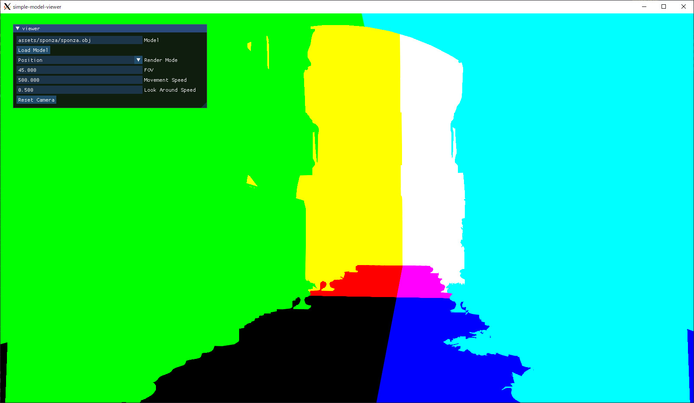
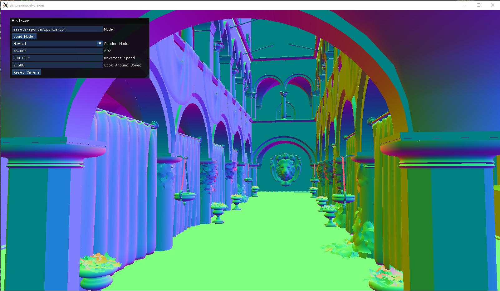
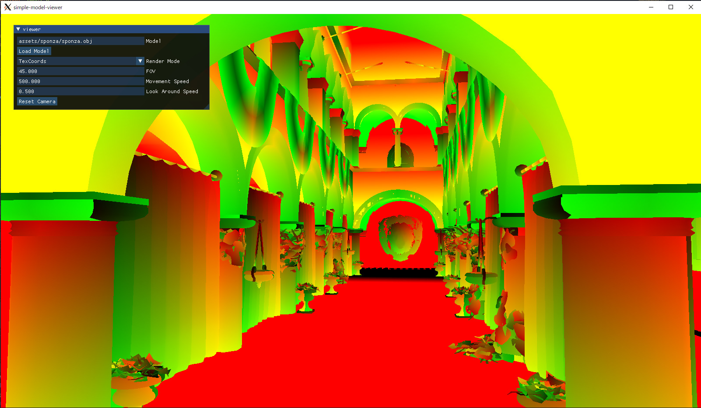
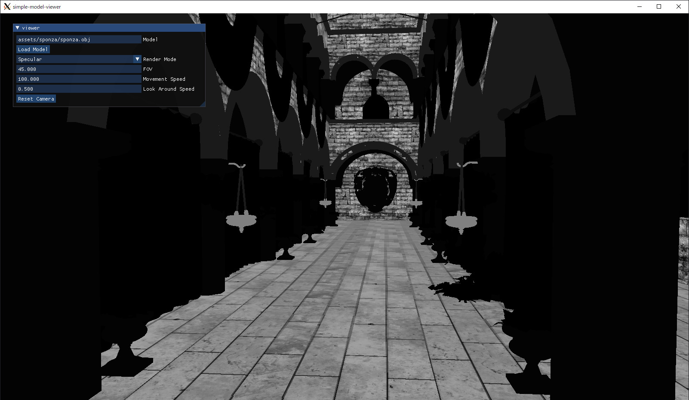

# simple-model-viewer


simple model viewer.

## Features

* Position Rendering
* Normal Rendering
* Texture Coordinates Rendering
* Diffuse Rendering
* Specular Rendering

## Requirements

* C++17
* CMake 3.12 or Higher
* OpenGL 3.3
* [assimp](https://github.com/assimp/assimp)

## Setup

```bash
git submodule update --init
```

## Build

```bash
mkdir build
cd build
cmake ..
make
```

## Gallery

### Position Rendering



### Normal Rendering



### Texture Coordinates Rendering



### Diffuse Rendering


### Specular Rendering



## Externals

* [glad](https://github.com/Dav1dde/glad)
* [glm](https://github.com/g-truc/glm)
* [GLFW](https://github.com/glfw/glfw)
* [assimp](https://github.com/assimp/assimp)
* [imgui](https://github.com/ocornut/imgui)
* [stb](https://github.com/nothings/stb)
* [McGuire Computer Graphics Archive](https://casual-effects.com/data/)